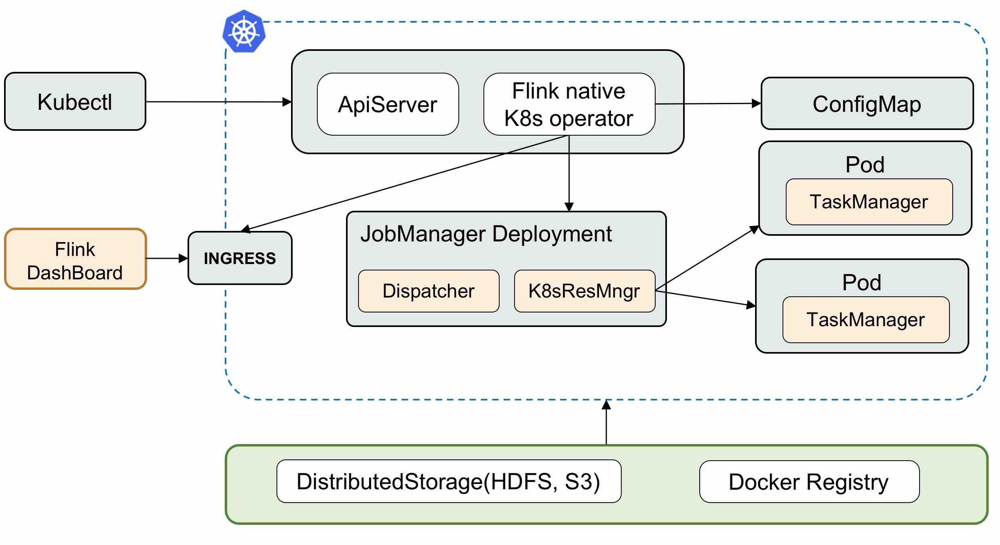

*NOTE: This project is deprecated. Please refer to the community official repo https://github.com/apache/flink-kubernetes-operator*

# Flink native K8s operator in Java



Flink native Kubernetes Operator is a control plane for running Apache Flink native application on Kubernetes. It is java 
implemented operator, which use fabric8 [Kubernetes Client](https://github.com/fabric8io/kubernetes-client) to contact with K8s apiserver.
Also instead of running shell commands `flink run/run-application` to start a Flink application, we choose to use Flink 
client interfaces to do this(e.g. `ApplicationDeployer`). Same for the savepoint and job status. Benefit from this, the operator will
have better performance to launch multiple applications.

## How to Build
```
   mvn clean install
```

## How to Run
1. Make Sure that FlinkApplication Custom Resource Definition is already applied onto the cluster. The CRD could be find [here](deploy/crd.yaml). If not, issue the following commands to apply:
 ```
 kubectl apply -f deploy/crd.yaml
 ```
2. Build Docker Image
```
docker build . -t flink-native-k8s-operator:1.0.x
docker push
```
3. Start flink-native-k8s-operator deployment
```
 kubectl apply -f deploy/flink-native-k8s-operator.yaml
```
4. Apply the RBAC for flink

A new `ServiceAccount` "flink" will be created with enough permission to create/delete pods and ConfigMaps.
```
 kubectl apply -f deploy/flink-rbac.yaml
```
5. Create a new Flink application

The flink-native-k8s-operator will watch the CRD resources and submit a new Flink application once the CR is applied.
```
kubectl apply -f deploy/cr.yaml
```

6. Get/List Flink applications
Get all the Flink applications running in the K8s cluster
```
kubectl get flinkapp
```

Describe a specific Flink application to show the status(including job status, savepoint, ect.)
```
kubectl describe flinkapp {app_name}
```

7. Delete a Flink application
```
kubectl delete -f deploy/cr.yaml

OR

kubectl delete flinkapp {app_name}
```

## How to access JobManager UI
By default, we expose the JobManager rest port with `ClusterIP`, which means it could only be accessed in the cluster. In 
order to access the webUI outside of the K8s cluster, the operator will try to create an ingress entry for each application.
Then you could use http://{app_name}.flink.k8s.io for the JobManager webUI.

<div class="alert alert-info" markdown="span">
  All the Flink app share a same ingress with different rules. This will save a lot public LoadBalancer ip requirements.

  You should add `{app_name}.flink.k8s.io {ingress_ip}` to your local /etc/hosts file.
  
  `kubectl get ingress flink-native-k8s-operator` could be used to get the ingress ip address.
</div>

## Features
https://github.com/wangyang0918/flink-native-k8s-operator/issues/27
